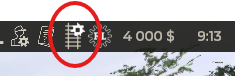
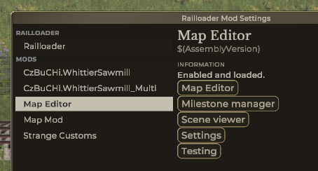

# Map editor

After installing mod new icon will appear in top right corner ...

and entry in railloader:

## Operations

| Operation         | Description                                                                        |
| ----------------- | ---------------------------------------------------------------------------------- |
| Map editor        | opens [editor main window](MainWindow.md) (same as clicking on icon in red circle) |
| Milestone manager | opens [Milestone manager](MilestoneManager.md) dialog                              |
| Scene viewer      | opens [Scene Viewer](SceneViewer.md) dialog                                        |
| Settings          | opens Settings dialog                                                              |
| Testing           | Ignore this one - for debug purposes only                                          |

## Dialogs accessible from elsewhere

-   [Track node editor](TrackNodeEditor.md)
-   [Track segment editor](TrackSegmentEditor.md)
-   [Telegraph pole editor](TelegraphPoleEditor.md)
