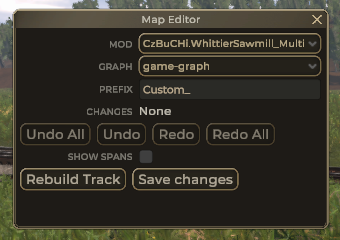

# Editor main window

Editor will work only if this window is open and have selected graph to edit.

note: if 'Graph' drop down is missing it means selected mod has only one game-graph.json file

-   **Prefix** ius used when creating new entities that require **ID**, new id is generated as: `entity type prefix` + `Prefix` + `3 random characters`

-   **Changes** show number of recored commands
-   **Undo all**, **Undo**, **Redo**, **Redo all** are operation on recorded commands
-   **Rebuild track** will tell game to rebuild tracks
-   **Save changes** will save game-graph.json file and clear changes

## How undo/redo works:

Say you have executed 5 commands:

`move node A`, `create node B`, `split segment C`, `move node D`, `move node E`

then you decide to undo couple of them:

`move node A`, `create node B`, `split segment C`, ~~`move node D`~~, ~~`move node E`~~

now you can hit redo to reexecute `move node D` or create new command `move node F` either way result would be sequence of those commands:

`move node A`, `create node B`, `split segment C`, `move node D` or `mode node F`

as you can see you lost command `mode node E` and can no longer undo/redo to that state
