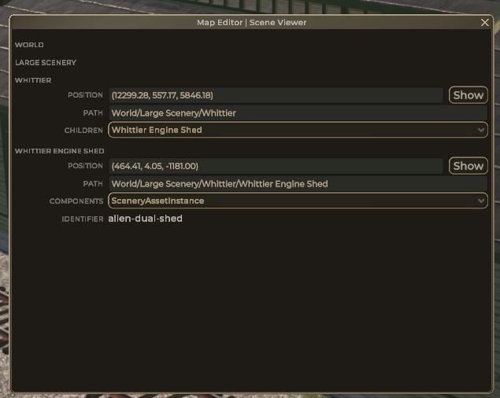

# Scene viewer

Simple viever of current game world objects inder root 'World'.

**Show** button right of position will make 3rd persion camera to face that position

Note to image: game objects **World** and **Large scenery** properties are hidden because **Whittier Engine Shed** ius selected to show them again you need to unselect **Whittier Engine Shed**.

Note: Not showing **Components** dropdown if there arent any

-   **Transform** component is always ignored here

Note: Not showing **Children** dropdown if there arent any

-   ignoring children with name starting with "Cube."
-   not showing children of **SceneryAssetInstance** and **Graph**
    -   SceneryAssetInstance is building
    -   Graph holds all track nodes, segments, spans - dropdown would be massive (7000+ entries)

Some componets may show extra data when selected (on image SceneryAssetInstance componets is showing value of identifier field)
