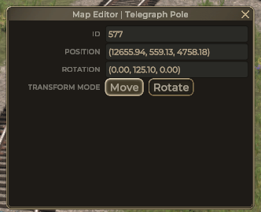
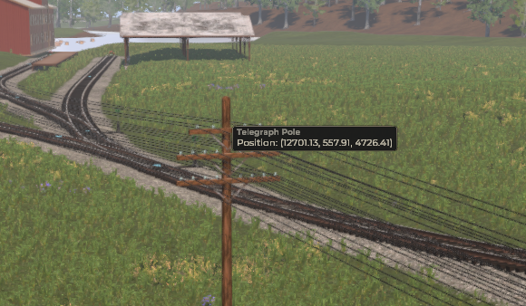

# Telegraph pole editor

To open this dialog you need to click on telegraph pole near the top:

-   Fields **ID**, **Position** and **Rotation** are read-only.
-   Transform mode tells editor what to do when keys are pressed.
