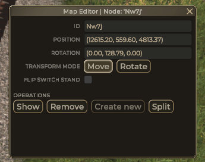
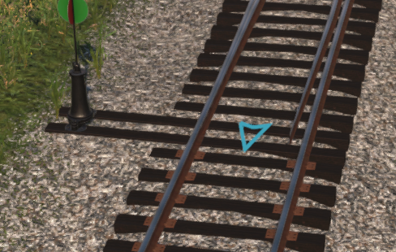
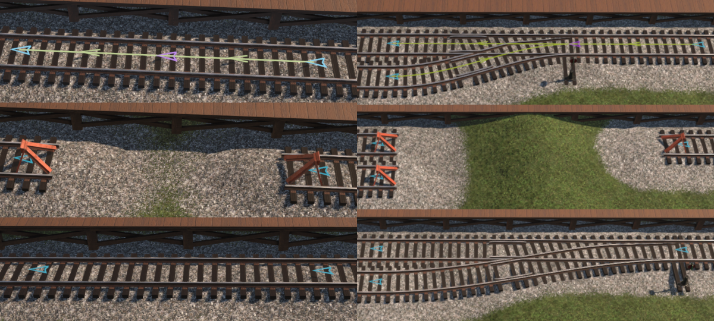

# Track node editor

To open this dialog you need to click on node visualizer:

-   Fields **ID**, **Position** and **Rotation** are read-only.
-   Transform mode tells editor ehat to do when keys are pressed.
-   Flip switch stand will place switch stand on other side of track.

## Operations

| Operation  | Description                                                                                                                 |
| ---------- | --------------------------------------------------------------------------------------------------------------------------- |
| Show       | make 3rd persion camera to face node (something like image above)                                                           |
| Remove     | remove node and connected segments  if **shift** key is hold it will connect other nodes to each other                   |
| Create new | create new node connected to current   disabled for switch node (game do not like more that 3 segments from single node) |
| Split      | split current node into multiple nodes (2 or 3 for switch)                                                                  |

Visual example of how **Remove** works:

-   top image is initial state (purple node is selected)
-   middle image is result without **Shift** key
-   bottom image is result with **Shift** key

