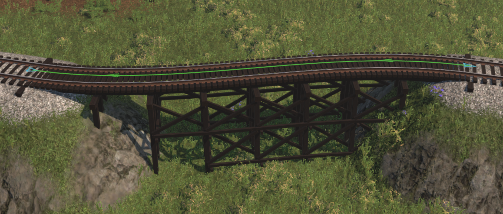

# Track segment editor

To open this dialog you need to click on one of chevrons on segment visualizer (short segments have only one in the middle). To show segment visualizer you need to select connected node first.

-   Fields **ID** is read-only.
-   Fields **Group Id**, **Priority**, **Speed limit**, **Track class** and **Track style** will not update in game until **Update properties** button is clicked

## Operations

| Operation         | Description                              |
| ----------------- | ---------------------------------------- |
| Update properties | will set all properties at once          |
| Remove            | remove segment                           |
| Split             | will place new node in middle ot segment |

When **Track style** is set to **Bridge** editor will automatically place thressle under given segment

