# Railroader Mod: Map Editor

## Alpha version of Editor, ~~if~~ when shomethings goes wrong, please tell me ...

### Requirements:

-   [Railloader](https://railroader.stelltis.ch/) 1.8+
-   [Strange Customs](https://railroader.stelltis.ch/mods/strange-customs) 1.7+

## Installation

-   Download `MapEditor-VERSION.zip` from the releases page
-   Install with [Railloader](<[https://www.nexusmods.com/site/mods/21](https://railroader.stelltis.ch/)>)
-   **MapMod** is required for telegraph pole modifications (when editor is not installed)

## Features

### Track node editor

-   move and rotate track node around
-   create new node from existing
-   delete existing
-   split existing into separate nodes

### Track segment editor

-   edit track segment properites (Group id, Priority, Speed limit, Style and Track class)
-   delete edisting
-   inject new node in middle of segment
-   reverse segment direction (aka swap start and end node)

### Telegraph pole editor

-   move and rotate telegraph pole around

### Milestone manager

Quick way to advance / revert progressions:

| Button                | Description                                                |
| --------------------- | ---------------------------------------------------------- |
| Advance               | advance single phase of selected progression               |
| Advance all phases    | advance all phases phases of selected progression          |
| Revert                | revert selected progression and all others depending on it |
| Advance Prerequisites | complete all prerequisites of selected progression         |

### Scene viever

Simple viever of current game world objects inder root 'World'

## Usage

After installing mod new icon will appear in top right corner ...

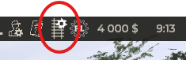

and entry in railloader:

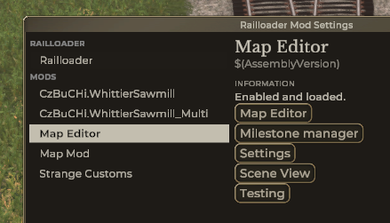

-   **Map editor** opens editor main window (same as clicking on icon in red circle)
-   **Milestone manager** helper to advance / revert milestones
-   **Settings** keyboard bingings for game objects transformations
-   **Scene view** helper to traverse game objects graph starting at 'World'
-   **Testing** ignore this one :)

### Editor main window

-   used to slecte game-graph to edit

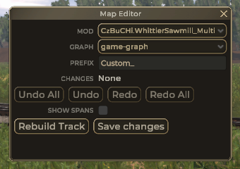

note: if 'Graph' drop down is missing it means selected mod has only one game-graph.json file

### Node visualizer

-   is shown after game-graph is selected in

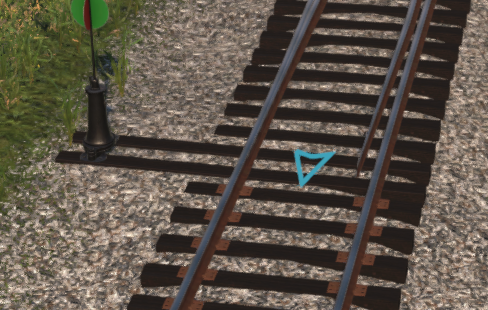

### Node dialog

Is opened by clicking on node visualizer.

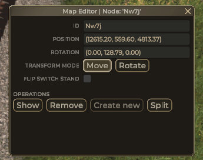

-   Id, Position and Rotation are read-only
-   you can now use keyboard to move / rotate node (see settings)
-   **Show** will move camera to track node location facing it
-   **Remove** will delete track node
    -   without **shift** key: removes node and connected segments (top result)
    -   with **shift** key: additionaly connect other nodes to each other (bottom result)

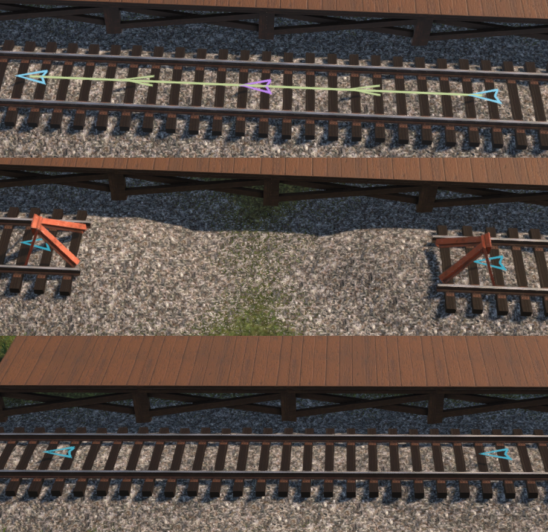

-   **Create new** will create new node connected to current one

    -   this button is disabled for switches as game do not allow more than 3 segments from single node
    -   when end node is selected new node is placed into empty space after

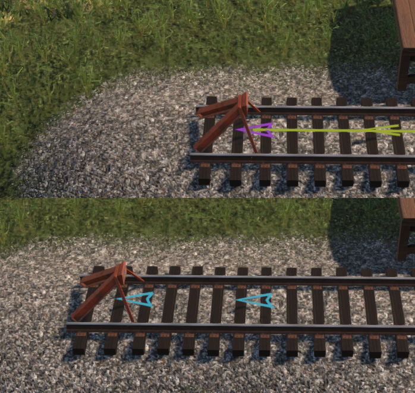

    -   when center node is selected new node is placed on the side

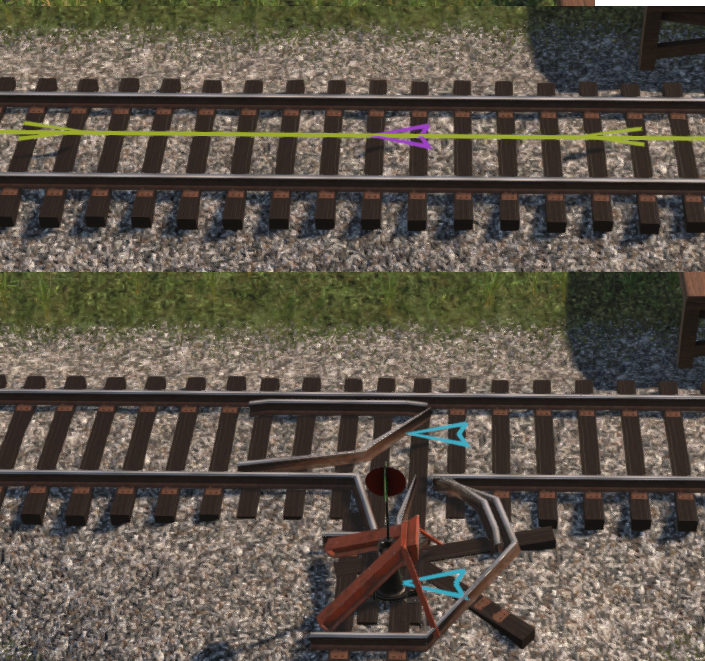

-   **Split** will create new node near current and connect one segment to it
    (note: node in red circle is original node)

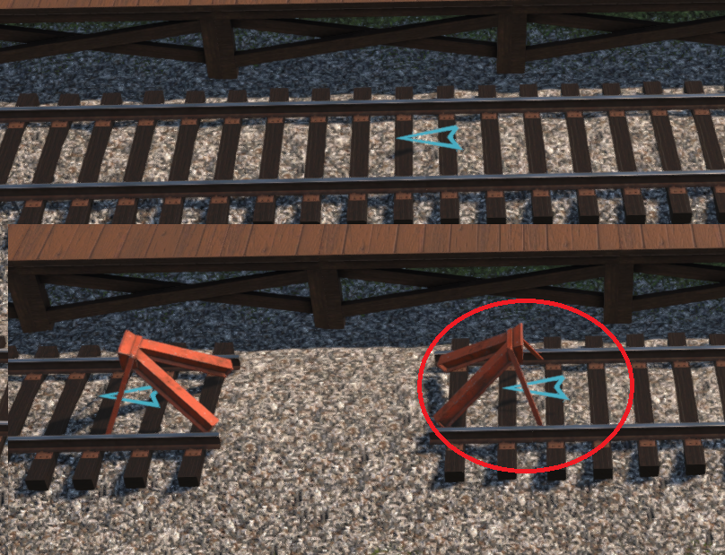

    -   in case of switch 2 new nodes are created

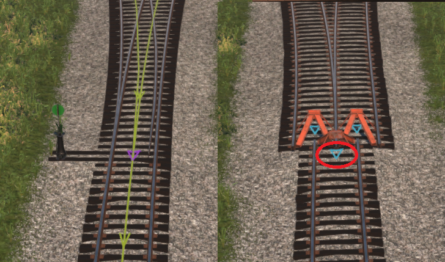

## Segment visualiser

is shown when node is sleected

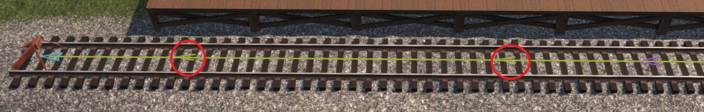

### Segment dialog

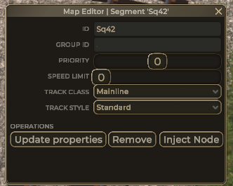

Is opened by clicking on segment visualizer chevron (in red circle).

note: for short segments there is only one chevron at segment center

-   Id isread-only
-   to save Group Id, priority, speed limit, track class and track style "Update properties" button needs to be clicked
-   when track style bridge is used tressle head/tail styles needs to be selected too

-   **Update properties** will generate single undo/redo operation to set all properties at once
-   **Remove** will remove segment
-   **Split** will place new node in middle ot segment
    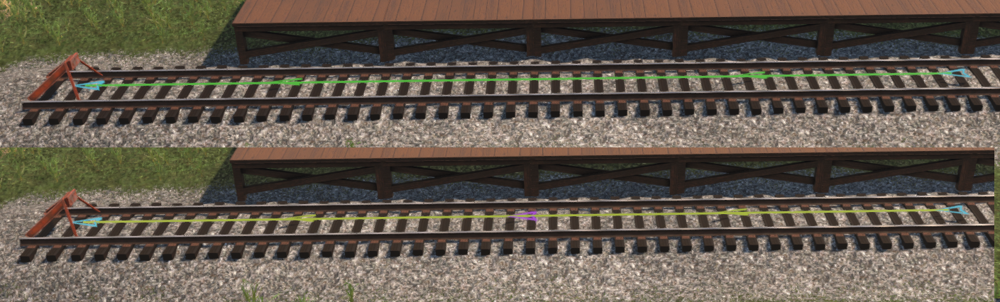

### Telegraph pole dialog

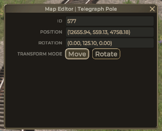

-   can be opened by clicking on telegraph pole somewhere inside red circle
-   Id, position and rotation are read-only
-   when opened keyboard ca be used to move/rotate pole
-   note: yellow arrow is pointing to selected telegraph pole
-   note: rotation is bit funky - rotate, then move

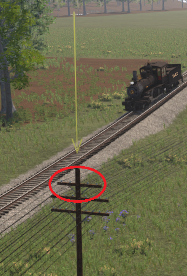

## Project Setup

In order to get going with this, follow the following steps:

1. Clone the repo
2. Copy the `Paths.user.example` to `Paths.user`, open the new `Paths.user` and set the `<GameDir>` to your game's directory.
3. Open the Solution
4. You're ready!

### During Development

Make sure you're using the _Debug_ configuration. Every time you build your project, the files will be copied to your Mods folder and you can immediately start the game to test it.

### Publishing

Make sure you're using the _Release_ configuration. The build pipeline will then automatically do a few things:

1. Makes sure it's a proper release build without debug symbols
1. Replaces `$(AssemblyVersion)` in the `Definition.json` with the actual assembly version.
1. Copies all build outputs into a zip file inside `bin` with a ready-to-extract structure inside, named like the project they belonged to and the version of it.
